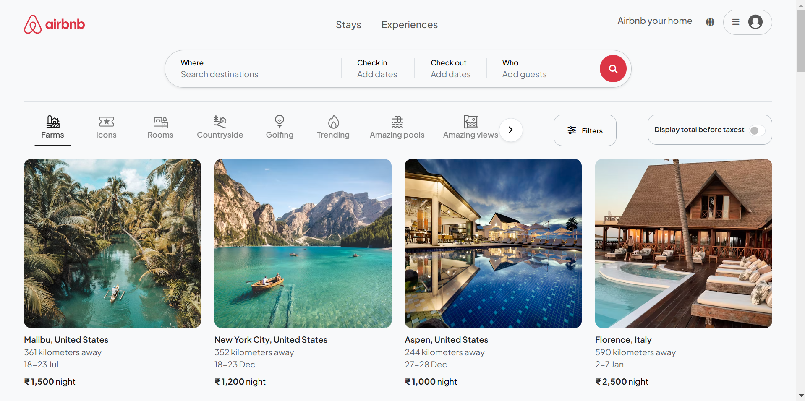

# Airbnb

This is the Airbnb Web App Clone

## Airbnb first look

This screenshot is after 60% completion.

flowchart TB
    subgraph Client
        Browser["Web Browser"]
    end
    subgraph "Frontend Layer"
        Views["Views (EJS)"]:::frontend
        StaticAssets["Static Assets"]:::frontend 
        subgraph "View Components"
            ListingViews["Listing Views"]:::frontend
            UserViews["User Views"]:::frontend
            SharedViews["Shared Components"]:::frontend
            LayoutViews["Layout Templates"]:::frontend
        end
        subgraph "Static Files"
            CSS["CSS Files"]:::frontend
            ClientJS["Client JavaScript"]:::frontend
            Icons["Icons"]:::frontend
        end
    end
    subgraph "Application Layer"
        ExpressServer["Express Server"]:::app
        CloudConfig["Cloud Configuration"]:::app
        subgraph "Routes"
            ListingRoutes["Listing Routes"]:::route
            ReviewRoutes["Review Routes"]:::route
            UserRoutes["User Routes"]:::route
        end
        subgraph "Controllers"
            ListingController["Listing Controller"]:::controller
            ReviewController["Review Controller"]:::controller
            UserController["User Controller"]:::controller
        end
        subgraph "Middleware"
            MainMiddleware["Main Middleware"]:::middleware
            ErrorHandler["Error Handling"]:::middleware
            AsyncHandler["Async Handler"]:::middleware
        end
    end
    subgraph "Data Layer"
        subgraph "Models"
            ListingModel["Listing Model"]:::model
            ReviewModel["Review Model"]:::model
            UserModel["User Model"]:::model
        end 
        SchemaValidation["Schema Validation"]:::model
        Database[(MongoDB)]:::database
        subgraph "Initialization"
            InitIndex["Init Index"]:::init
            InitData["Sample Data"]:::init
        end
    end
    %% Relationships
    Browser <--> Views
    Browser <--> StaticAssets
    Views --> |Renders| ListingViews & UserViews & SharedViews & LayoutViews
    StaticAssets --> |Serves| CSS & ClientJS & Icons
    ExpressServer --> |Routes Requests| ListingRoutes & ReviewRoutes & UserRoutes
    ListingRoutes --> ListingController
    ReviewRoutes --> ReviewController
    UserRoutes --> UserController
    MainMiddleware -.-> ExpressServer
    ErrorHandler -.-> ExpressServer
    AsyncHandler -.-> ExpressServer
    ListingController --> ListingModel
    ReviewController --> ReviewModel
    UserController --> UserModel
    ListingModel & ReviewModel & UserModel --> Database
    SchemaValidation -.-> ListingModel & ReviewModel & UserModel
    InitIndex --> InitData
    InitData --> Database
    %% Click Events
    click ListingViews "https://github.com/VedantPatil-99/Airbnb/tree/main/views/listings/"
    click UserViews "https://github.com/VedantPatil-99/Airbnb/tree/main/views/users/"
    click SharedViews "https://github.com/VedantPatil-99/Airbnb/tree/main/views/includes/"
    click LayoutViews "https://github.com/VedantPatil-99/Airbnb/tree/main/views/layouts/"
    click CSS "https://github.com/VedantPatil-99/Airbnb/tree/main/public/css/"
    click ClientJS "https://github.com/VedantPatil-99/Airbnb/tree/main/public/js/"
    click Icons "https://github.com/VedantPatil-99/Airbnb/tree/main/public/icon/"
    click ExpressServer "https://github.com/VedantPatil-99/Airbnb/blob/main/app.js"
    click CloudConfig "https://github.com/VedantPatil-99/Airbnb/blob/main/cloudConfig.js"
    click ListingRoutes "https://github.com/VedantPatil-99/Airbnb/blob/main/routes/listing.js"
    click ReviewRoutes "https://github.com/VedantPatil-99/Airbnb/blob/main/routes/review.js"
    click UserRoutes "https://github.com/VedantPatil-99/Airbnb/blob/main/routes/user.js"
    click ListingController "https://github.com/VedantPatil-99/Airbnb/blob/main/controllers/listings.js"
    click ReviewController "https://github.com/VedantPatil-99/Airbnb/blob/main/controllers/reviews.js"
    click UserController "https://github.com/VedantPatil-99/Airbnb/blob/main/controllers/users.js"
    click MainMiddleware "https://github.com/VedantPatil-99/Airbnb/blob/main/middleware.js"
    click ErrorHandler "https://github.com/VedantPatil-99/Airbnb/blob/main/utils/ExpressError.js"
    click AsyncHandler "https://github.com/VedantPatil-99/Airbnb/blob/main/utils/wrapAsync.js"
    click ListingModel "https://github.com/VedantPatil-99/Airbnb/blob/main/models/listings.js"
    click ReviewModel "https://github.com/VedantPatil-99/Airbnb/blob/main/models/review.js"
    click UserModel "https://github.com/VedantPatil-99/Airbnb/blob/main/models/user.js"
    click SchemaValidation "https://github.com/VedantPatil-99/Airbnb/blob/main/schema.js"
    click InitIndex "https://github.com/VedantPatil-99/Airbnb/blob/main/init/index.js"
    click InitData "https://github.com/VedantPatil-99/Airbnb/blob/main/init/data.js"
    %% Styles
    classDef frontend fill:#2196F3,stroke:#1565C0,color:white
    classDef app fill:#4CAF50,stroke:#2E7D32,color:white
    classDef route fill:#81C784,stroke:#4CAF50,color:black
    classDef controller fill:#66BB6A,stroke:#43A047,color:white
    classDef middleware fill:#FF5252,stroke:#D32F2F,color:white
    classDef model fill:#FFB74D,stroke:#FF9800,color:black
    classDef database fill:#FFA726,stroke:#F57C00,color:white
    classDef init fill:#90A4AE,stroke:#607D8B,color:white
