# Airbnb

This is the Airbnb Web App Clone (Full stack project)

## Airbnb first look

This screenshot is after 60% completion.


## Web Application Architecture

```mermaid
flowchart TB
    subgraph Client
        Browser["Web Browser"]
    end

    subgraph "Frontend Layer"
        Views["Views (EJS)"]:::frontend
        StaticAssets["Static Assets"]:::frontend

        subgraph "View Components"
            ListingViews["Listing Views"]:::frontend
            UserViews["User Views"]:::frontend
            SharedViews["Shared Components"]:::frontend
            LayoutViews["Layout Templates"]:::frontend
        end

        subgraph "Static Files"
            CSS["CSS Files"]:::frontend
            ClientJS["Client JavaScript"]:::frontend
            Icons["Icons"]:::frontend
        end
    end

    subgraph "Application Layer"
        ExpressServer["Express Server"]:::app
        CloudConfig["Cloud Configuration"]:::app

        subgraph "Routes"
            ListingRoutes["Listing Routes"]:::route
            ReviewRoutes["Review Routes"]:::route
            UserRoutes["User Routes"]:::route
        end

        subgraph "Controllers"
            ListingController["Listing Controller"]:::controller
            ReviewController["Review Controller"]:::controller
            UserController["User Controller"]:::controller
        end

        subgraph "Middleware"
            MainMiddleware["Main Middleware"]:::middleware
            ErrorHandler["Error Handling"]:::middleware
            AsyncHandler["Async Handler"]:::middleware
        end
    end

    subgraph "Data Layer"
        subgraph "Models"
            ListingModel["Listing Model"]:::model
            ReviewModel["Review Model"]:::model
            UserModel["User Model"]:::model
        end

        SchemaValidation["Schema Validation"]:::model
        Database[(MongoDB)]:::database

        subgraph "Initialization"
            InitIndex["Init Index"]:::init
            InitData["Sample Data"]:::init
        end
    end

    %% Relationships
    Browser <--> Views
    Browser <--> StaticAssets
    Views --> |Renders| ListingViews & UserViews & SharedViews & LayoutViews
    StaticAssets --> |Serves| CSS & ClientJS & Icons

    ExpressServer --> |Routes Requests| ListingRoutes & ReviewRoutes & UserRoutes
    ListingRoutes --> ListingController
    ReviewRoutes --> ReviewController
    UserRoutes --> UserController

    MainMiddleware -.-> ExpressServer
    ErrorHandler -.-> ExpressServer
    AsyncHandler -.-> ExpressServer

    ListingController --> ListingModel
    ReviewController --> ReviewModel
    UserController --> UserModel

    ListingModel & ReviewModel & UserModel --> Database
    SchemaValidation -.-> ListingModel & ReviewModel & UserModel

    InitIndex --> InitData
    InitData --> Database

    %% Click Events
    click ListingViews "https://github.com/VedantPatil-99/Airbnb/tree/main/views/listings/"
    click UserViews "https://github.com/VedantPatil-99/Airbnb/tree/main/views/users/"
    click SharedViews "https://github.com/VedantPatil-99/Airbnb/tree/main/views/includes/"
    click LayoutViews "https://github.com/VedantPatil-99/Airbnb/tree/main/views/layouts/"
    click CSS "https://github.com/VedantPatil-99/Airbnb/tree/main/public/css/"
    click ClientJS "https://github.com/VedantPatil-99/Airbnb/tree/main/public/js/"
    click Icons "https://github.com/VedantPatil-99/Airbnb/tree/main/public/icon/"
    click ExpressServer "https://github.com/VedantPatil-99/Airbnb/blob/main/app.js"
    click CloudConfig "https://github.com/VedantPatil-99/Airbnb/blob/main/cloudConfig.js"
    click ListingRoutes "https://github.com/VedantPatil-99/Airbnb/blob/main/routes/listing.js"
    click ReviewRoutes "https://github.com/VedantPatil-99/Airbnb/blob/main/routes/review.js"
    click UserRoutes "https://github.com/VedantPatil-99/Airbnb/blob/main/routes/user.js"
    click ListingController "https://github.com/VedantPatil-99/Airbnb/blob/main/controllers/listings.js"
    click ReviewController "https://github.com/VedantPatil-99/Airbnb/blob/main/controllers/reviews.js"
    click UserController "https://github.com/VedantPatil-99/Airbnb/blob/main/controllers/users.js"
    click MainMiddleware "https://github.com/VedantPatil-99/Airbnb/blob/main/middleware.js"
    click ErrorHandler "https://github.com/VedantPatil-99/Airbnb/blob/main/utils/ExpressError.js"
    click AsyncHandler "https://github.com/VedantPatil-99/Airbnb/blob/main/utils/wrapAsync.js"
    click ListingModel "https://github.com/VedantPatil-99/Airbnb/blob/main/models/listings.js"
    click ReviewModel "https://github.com/VedantPatil-99/Airbnb/blob/main/models/review.js"
    click UserModel "https://github.com/VedantPatil-99/Airbnb/blob/main/models/user.js"
    click SchemaValidation "https://github.com/VedantPatil-99/Airbnb/blob/main/schema.js"
    click InitIndex "https://github.com/VedantPatil-99/Airbnb/blob/main/init/index.js"
    click InitData "https://github.com/VedantPatil-99/Airbnb/blob/main/init/data.js"

    %% Styles
    classDef frontend fill:#2196F3,stroke:#1565C0,color:white
    classDef app fill:#4CAF50,stroke:#2E7D32,color:white
    classDef route fill:#81C784,stroke:#4CAF50,color:black
    classDef controller fill:#66BB6A,stroke:#43A047,color:white
    classDef middleware fill:#FF5252,stroke:#D32F2F,color:white
    classDef model fill:#FFB74D,stroke:#FF9800,color:black
    classDef database fill:#FFA726,stroke:#F57C00,color:white
    classDef init fill:#90A4AE,stroke:#607D8B,color:white
```



```Folder structure
Airbnb/
├─ .env
├─ .gitignore
├─ .vscode/
│  └─ settings.json
├─ app.js
├─ cloudConfig.js
├─ controllers/
│  ├─ listings.js
│  ├─ reviews.js
│  └─ users.js
├─ init/
│  ├─ data.js
│  ├─ index.js
│  └─ oldData.js
├─ middleware.js
├─ models/
│  ├─ listings.js
│  ├─ review.js
│  └─ user.js
├─ package-lock.json
├─ package.json
├─ public/
│  ├─ css/
│  │  ├─ curnc_langM.css
│  │  ├─ filters.css
│  │  ├─ footer.css
│  │  ├─ map.css
│  │  ├─ rating.css
│  │  ├─ reviews.css
│  │  ├─ showDetails.css
│  │  └─ style.css
│  ├─ icons/
│  │  ├─ Airbnb_firstlook.png
│  │  ├─ Airbnb_icon.png
│  │  └─ filterIcons/
│  │     ├─ a-frames.jpg
│  │     ├─ amazing_pools.jpg
│  │     ├─ amazing_views.jpg
│  │     ├─ arctic.jpg
│  │     ├─ beach.jpg
│  │     ├─ beachfront.jpg
│  │     ├─ bed&breakfasts.jpg
│  │     ├─ boats.jpg
│  │     ├─ cabins.jpg
│  │     ├─ camping.jpg
│  │     ├─ castles.jpg
│  │     ├─ caves.jpg
│  │     ├─ countryside.jpg
│  │     ├─ creative-spaces.jpg
│  │     ├─ desert.jpg
│  │     ├─ design.jpg
│  │     ├─ domes.jpg
│  │     ├─ farms.jpg
│  │     ├─ golfing.jpg
│  │     ├─ historical-homes.jpg
│  │     ├─ island.jpg
│  │     ├─ lake.jpg
│  │     ├─ lakefront.jpg
│  │     ├─ luxe.jpg
│  │     ├─ mansions.jpg
│  │     ├─ minsus.jpg
│  │     ├─ Naruto.jpg
│  │     ├─ off-the-grid.jpg
│  │     ├─ OMG.jpg
│  │     ├─ parks.jpg
│  │     ├─ rooms.jpg
│  │     ├─ tiny-homes.jpg
│  │     ├─ top-cities.jpg
│  │     ├─ top-of-the-world.jpg
│  │     ├─ towers.jpg
│  │     ├─ treehouses.jpg
│  │     ├─ trending.jpg
│  │     ├─ tropical.jpg
│  │     └─ windmills.jpg
│  └─ js/
│     ├─ amenities.js
│     ├─ currencyM.js
│     ├─ filters.js
│     ├─ langM.js
│     ├─ map.js
│     ├─ randomDays.js
│     ├─ script.js
│     ├─ searchBar.js
│     └─ showRatings.js
├─ README.md
├─ routes/
│  ├─ listing.js
│  ├─ review.js
│  └─ user.js
├─ schema.js
├─ utils/
│  ├─ amenities.js
│  ├─ ExpressError.js
│  ├─ SVGs.js
│  └─ wrapAsync.js
└─ views/
   ├─ error.ejs
   ├─ includes/
   │  ├─ addReviews.ejs
   │  ├─ allReviews.ejs
   │  ├─ filters.ejs
   │  ├─ flash.ejs
   │  ├─ footer.ejs
   │  ├─ logo.ejs
   │  ├─ modalBox/
   │  │  ├─ allReviewsM.ejs
   │  │  ├─ currencyM.ejs
   │  │  ├─ filtersM.ejs
   │  │  ├─ langM.ejs
   │  │  ├─ logModal.ejs
   │  │  ├─ modal.ejs
   │  │  ├─ showAmenitiesM.ejs
   │  │  └─ showDescM.ejs
   │  ├─ navbar.ejs
   │  ├─ searchBar.ejs
   │  └─ showDetails.ejs
   ├─ layouts/
   │  └─ boilerplate.ejs
   ├─ listings/
   │  ├─ edit.ejs
   │  ├─ index.ejs
   │  ├─ new.ejs
   │  └─ show.ejs
   └─ users/
      ├─ login.ejs
      └─ signup.ejs
```
